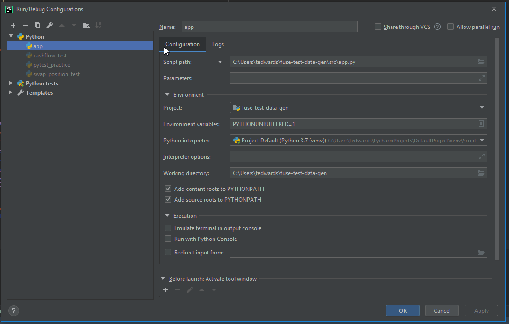
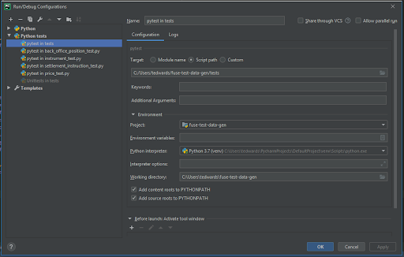
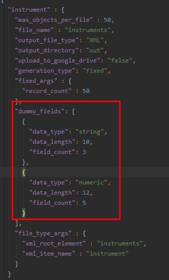
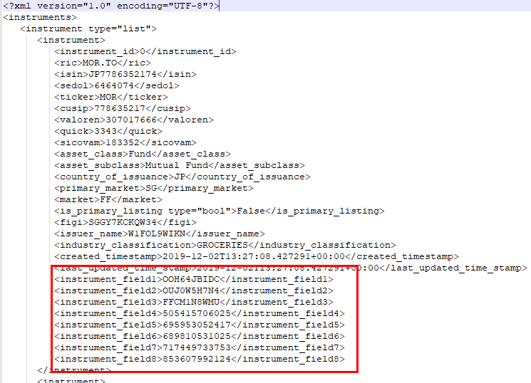

# fuse-test-data-gen
## Overview
FUSE-TEST-Data-Gen is an internal system for generating and exporting dummy financial data which reflects a realistic client data set. Its intended use case is generation of bulk data in various formats (xml, csv, json, etc) for testing purposes, or use within POCs.

## Run Requirements
To run the generator locally, you are required to clone the repo:
- FUSE Test Data Gen (https://github.com/galatea-associates/fuse-test-data-gen)
-- The most up-to-date and code-reviewed branch is develop

Then install:
- Python 3.7+ (https://www.python.org/downloads/)
- Visual Studio C++ Build Tools	(https://visualstudio.microsoft.com/thank-you-downloading-visual-studio/?sku=BuildTools&rel=16)
- Install Project Dependencies (run on command line: `pip install -r requirements.txt`)

## Architecture Overview
### Domain Objects

A domain object is an entity that represents a real-world business object, such as a position or a trade.

Each domain object is created by a specific factory class in the `domainobjectfactories` package.  Each factory class extends `Generatable`.  If you wish to add a new domain object you need to create a new python module containing a single class which extends `Generatable`.

A document listing all the current domain objects and their component fields can be found in the Appendices of the [requirements document](https://drive.google.com/open?id=1xfuqEZfgYiRK-AcDR_yacHhICEKhxMxqTKFRk0-Ubg0).

### File Builders

A file builder is a self contained piece of functionality which, given a dataset, will build a file according to a specified data format and output that file to a specified location.

Each file builder is represented by a single Python module containing a single Python class, these modules reside in the `filebuilders` package. Each class extends the abstract class `FileBuilder`, which defines an abstract method `build`. Initial file builders are JSON, CSV and XML. If you wish to add a new file builder, simply create a new python module inside the `filebuilders` package containing a single class which extends the `FileBuilder` abstract class and implements the abstract method `build`. The `build` method should accept a list of dictionaries (one dictionary per domain object) and use that dataset to generate a file.

## Running the Generator

Running data generation locally requires a configuration file be provided. Provision of a configuration file is done either via command-line argument specifying its file path, or by creating it in the default location: ‘src/config.json’.

### Command Line Execution

Define a configuration file as per above, or another, known, location. The default configuration is located in ```src/config.json```. Run the following command from the top-level directory of the repository:
```python src/app.py (optional: --config <config_path.json>)```

Where no configuration argument is given, the program defaults to the path ‘src/config.json’

### In-IDE Execution
Define a configuration file located as per the default location or configure project run-time arguments to point to a configuration file located elsewhere.

#### Pycharm Run Config


#### Pycharm Test Run Config


## Configuration Files
Execution relies on two JSON config files.  Default versions are provided, although you can replace them with new files with your own specific config if required.

### dev_config.json
This file contains configuration that would usually only be set by a developer and we wouldn’t expect an end-user to need to update this file.  It contains two sections:
* dev_factory_args
    * Includes a key for every object we can generate
    * Keys maps to two values
        * module_name is the name of the module containing the factory class which creates this object
        * class_name is the name of the factory class which creates this object
        * Note the naming convention for the module and class names, these reflect the PEP 8 coding style. The "file_builder_name" value must reflect the "name" attribute of one of the file builders.
* dev_file_builder_args
    * Includes a key for every file format the output can take (e.g. CSV, XML, etc)
    * Key maps to three values
        * module_name is the name of the module containing the class which will create output files in this format
        * class_name is the name of class which will create output files in this format
        * file_extension is the file extension that will be given to all files created in this format

### config.json
config.json contains the configuration stating which objects should be created, how many of them there will be and what data should be included in those objects.

Each object created needs its own key.  Each key should map to the following items:
* max_objects_per_file: The maximum number of records that will be included in a single file
* file_name: Output file name
    * Where multiple files are generated for the same domain object, output files are named sequentially as per: object_000.json, object_001.json and so on.
* output_file_type: This must refer to one of the keys under dev_file_builder_args in the dev_config.json file
* output_directory: Output directory for generated files
* upload_to_google_drive: Whether the files containing this object will be uploaded to Google Drive
* generation_type: Holdover from the Ari/Kyle PoC.  The only correct value is “fixed”
* fixed_args:
    * record_count: Number of records to generate
* dummy_fields: (more information in following section)
    * data_type: Whether the dummy values should be numbers or alphanumeric strings
    * data_length: How many characters long the dummy values should be
    * field_count: How many dummy values should be created
* field_type_args: (field is only required when xml files are being generated)
    * xml_root_element: The name to give to outmost node of the xml file produced
    * xml_item_name: The name to give to the individual nodes of the xml file produced
* shared_args:
    * google_drive_root_folder_id: the ID (taken from the URL) of the folder in Google Drive that the output files will be uploaded to
    * generator_pool_size: **Help me explain with Wilf**

#### dummy_fields
One of the requirements was for users to be able to provide parameters to describe “the shape and volume of data you want to generate”.  In order to do this we decided to allow users to include dummy fields in the objects generated.  These dummy fields allow users to increase the number of fields generated for each record and specify the type of those fields.

E.g. the following entry in the config will mean that when instruments are generated each instrument will contain all the fields described in the data model along with 3 dummy fields containing alphanumeric strings 10 characters long and 5 dummy fields each containing a 12-digit number





## Google Drive Location

The default Google Drive folder id in the config is “1xTc_fiiIoNxrmHFgviJR1FxlUtdgXSSv“ which points to a folder accessible to anyone within Galatea.  The folder is called “FUSE-Test-Data-Gen-Uploads” and is accessible [here](https://drive.google.com/drive/folders/1xTc_fiiIoNxrmHFgviJR1FxlUtdgXSSv?usp=sharing).

When files are uploaded to Google drive, they will be uploaded into a folder with the current UTC time (HHMMSS) as the name with a parent folder with today's date (YYYY-MM-DD) as the name. If the folder doesn't exist for today, it will be created.

When uploading to Google Drive for the first time, you will be required to login using your Galatea Google account, a browser window should automatically load to allow you do this. Once you have done this, an authentication token file "token.pickle" will be downloaded onto your machine. When running the service remotely, it is important to ensure that a valid token.pickle file exists in the same directory as the application.


## Jenkins Build
The Galatea Jenkins server can be found at: https://jenkins.fuse.galatea-associates.com/.
The FUSE-Test-Data-Gen job is the job for this project.
### Pipeline
The Jenkinsfile defines a pipeline of the stages Jenkins will perform, the order in which to perform them, the commands required to execute them, as well as any options and environment details. The current stages in this project are:
### Install Requirements
Runs `pip install -r requirements.txt` to install the necessary plugins to the virtual environment.
### Run Unit Tests
Executes the tests as supplied in the `tests/unit/` directory. Names of test files must be preceeded with `test_`
### Discovery Method
The discovery method is set within the configuration of the job itself rather than any external file. It is currently set to scan the repo & run once daily if not otherwise executed. Branches are automatically detected if they contain a Jenkinsfile.

## Objects and Object Dependencies
Dependencies arise where objects leverage information from previously generated objects.  Usually this takes the form of one object referring to an identifier from another object (much like a primary key <-> foreign key relationship) e.g. The Trade objects refer to Account IDs from Account objects and ISINs from Instrument objects.  All the dependencies can be seen in the [Data Model tables in the Requirements document](https://docs.google.com/document/d/1xfuqEZfgYiRK-AcDR_yacHhICEKhxMxqTKFRk0-Ubg0/edit#bookmark=id.65gqop3v71cv).

Cross-object consistency means care must be taken when generating some objects to ensure its requirements have been generated as well e.g. if you with to generate Trade objects you must also generate Account and Instrument objects.

| Domain Objects | Dependencies |
--- | ---
| Account | |
| Instrument | |
| Price | Instrument |
| Cash Balance | Account |
| Back Office Position | Account, Instrument |
| Depot Position | Account, Instrument |
| Front Office Position | Account, Instrument |
| Settlement Instruction | Account, Instrument |
| Trade  | Account, Instrument |

## Outputs
Generation output is done on a per-object basis. As per the configuration, each object has an amount to generate, a maximum file size to adhere to, and a format. Where the number to generate exceeds the maximum file size, multiple files are generated. The file naming convention is sequential, for instance: instrument_000.json, instrument_001.json, and so on.
